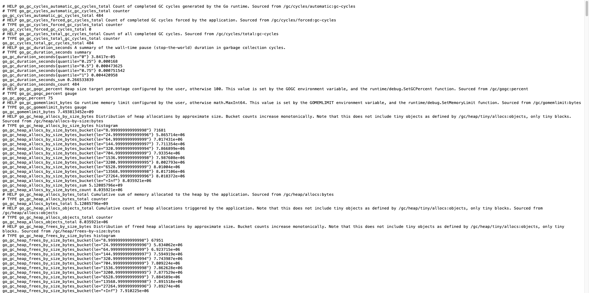
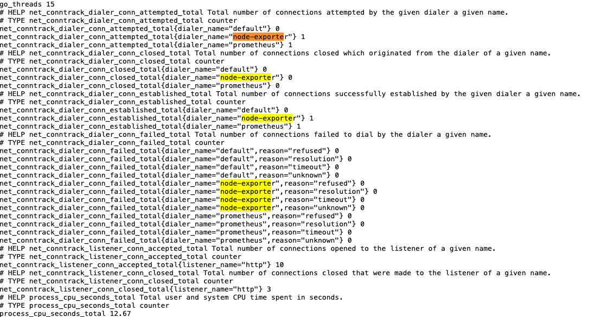
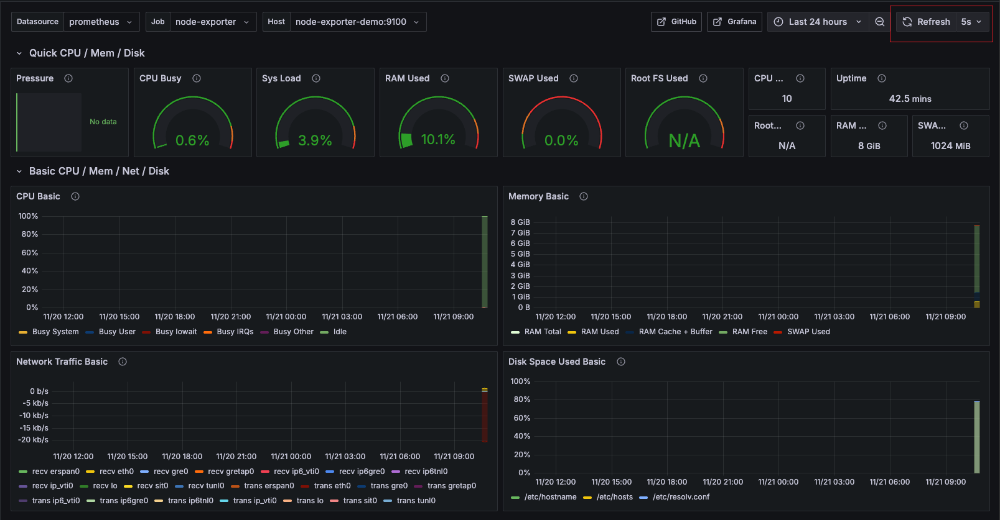

# 系统监控｜Grafana+Prometheus实践

- [ ] 在Linux中使用，node-exporter监控宿主机，而不是容器内
- [ ] 补充文件挂载相关说明信息

## 前置要求

- Linux macOS Windows
- docker && docker compose 
- git

## 快速开始

### 启动项目

克隆项目
```shell
git clone https://github.com/xiaolinstar/docker-prometheus.git
```

进入项目目录
```shell
cd docker-prometheus
```

`docker compose`启动项目
```shell
docker compose up -d
```

### 项目结构

```
.
├── README.md # 项目说明
├── docker-compose.yaml # docker-compose配置文件
├── prometheus.yml # prometheus配置文件，需要挂在到prometheus容器中
└── volume # 宿主机与容器挂载目录
```

### 访问

#### 检查prometheus数据
浏览器中输入`localhost:9090/metrics`

效果如下：



配置文件`prometheus.yml`中`scrape_configs`包含`prometheus`和`node-exporter`两个数据源

使用`ctrl+f`查看是否有`node-exporter`数据



#### 配置grafana

浏览器中输入`localhost:9080`，使用账号密码`admin/admin`登录`grafana web`

**添加数据源**

Connection -> Data Source -> Add new data source -> Prometheus -> Settings


输入的地址为`prometheus-url`为`http://prometheus-demo:9090`

下拉并点击`Save & Test`


**导入dashboard**

回到`grafana web`首页，执行 Dashboards -> New -> Import

导入`Node Exporter Full`模板，ID为`1860`，然后点击`Load`


操作成功效果如下：


右上角`Refresh`按钮可以刷新数据，右侧可以调整刷新周期


## 参考

1. Node-Exporter, https://github.com/prometheus/node_exporter
2. Grafana, https://grafana.com/
3. Grafana dashboards, Node Exporter Full, https://grafana.com/grafana/dashboards/1860-node-exporter-full/
4. Docker Compose, https://github.com/docker/compose

