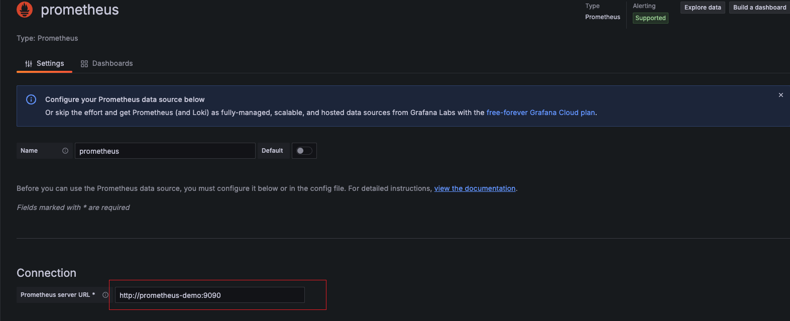

# 系统监控｜Grafana+Prometheus实践

- [X]  在Linux中使用，node-exporter监控宿主机，而不是容器内
- [ ]  补充文件挂载相关说明信息

## 前置要求

操作系统：
- 开发环境：MacOS Windows
- 生产环境：Linux

容器支持：
- Docker
- Docker compose

## 项目启动

### Quick Start

> 本小节内容与操作系统无关，无需修改任何配置，快速启动和体验grafana和prometheus

克隆项目

```shell
# GitHub
git clone https://github.com/xiaolinstar/docker-prometheus.git
# Gitee


```

进入项目目录

```shell
cd docker-prometheus
```

使用`docker compose`启动项目，默认指定`docker-compose.yaml`为容器集合启动配置

```shell
docker compose up -d
```

其他`docker compose`命令
```shell
# 容器启动，以后台方式
docker compose up -d
# 容器卸载
docker compose down

# 容器启动
docker compose start
# 容器停止
docker compose stop
```

当不再使用时，可进行容器卸载`down`，完全删除所启动的容器集合。
短暂不使用容器，则使用`start`和`stop` 

### 项目结构

```
.
├── README.md # 项目说明
├── docker-compose.yaml # docker-compose配置文件
└── prometheus.yml # prometheus配置文件，需要挂在到prometheus容器中
```

### 访问

#### 检查prometheus数据

Web浏览器中输入`localhost:9090/targets`查看数据源状态

效果如下：


配置文件`prometheus.yml`中`scrape_configs`包含`prometheus`和`node-exporter`两个数据源

可以查看到`Status`状态为`UP`，表示数据源正常

#### 配置grafana

浏览器中输入`localhost:9080`，使用账号密码`admin/admin`登录`grafana web`，账户密码可在`docker-compose.yaml`中自定义设置。

**添加数据源**

Connection -> Data Source -> Add new data source -> Prometheus -> Settings




输入的地址为`prometheus-url`为`http://prometheus-demo:9090`

下拉并点击`Save & Test`


**导入dashboard**

回到`grafana web`首页，执行 Dashboards -> New -> Import

导入`Node Exporter Full`模板，ID为`1860`，然后点击`Load`


选择数据源为上一步骤中配置的数据源`prometheus`

操作成功效果如下：


右上角`Refresh`按钮可以刷新数据，右侧可以调整刷新周期


### 深入配置：Node-Exporter监控宿主机

> 网络上大多数相关教程使用二进制启动服务，而在上一小节Quick Start中，grafana prometheus node-exporter三个服务均适用docker启动。这会产生一个问题：node-exporter监控的是容器本身，而不是宿主机，因此本小节尝试使用node-exporter容器监控宿主机，并最小化配置修改，达到最高可移植性。


Docker网络模式中默认且最常用的是`bridge`，其次是`host`类似于在宿主机上启动二进制服务。

本小节将`Node-Exporter`容器以`host`模式启动，使得作用域为宿主机，而`grafana`和`prometheus`是宿主机无关的，使用网桥模式启动以保持隔离性。

---

**切换到分支ne-host**

> 注意本分支在Linux系统中启动，如阿里云服务器、腾讯云服务器等
> Git是版本控制工具，可以在分支中维护多种代码，在分支中切换不同版本，而不需要修改任何代码。
> 注意：在切换分支前，请先卸载Quick Start中的容器(docker compose down)，否则会冲突

切换到分支`ne-host`

```shell
git checkout ne-host
```

服务启动
```shell
docker compose up -d
```


## 参考

1. Node-Exporter, https://github.com/prometheus/node_exporter
2. Grafana, https://grafana.com/
3. Grafana dashboards, Node Exporter Full, https://grafana.com/grafana/dashboards/1860-node-exporter-full/
4. Docker Compose, https://github.com/docker/compose
5. Run Grafana Docker image, https://grafana.com/docs/grafana/next/setup-grafana/installation/docker/#migrate-to-v51-or-later
