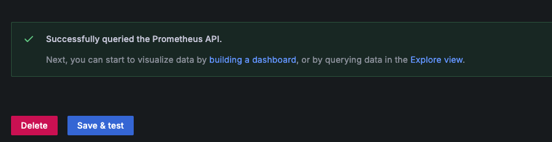

# 系统监控｜Grafana+Prometheus实践

- [X]  在Linux中使用，node-exporter监控宿主机，而不是容器内
- [ ]  补充文件挂载相关说明信息，数据持久化
- [ ]  监控更多中间件以及服务，mysql、redis、rabbitmq等
- [ ]  自定义监控微服务业务指标

## 前置要求

操作系统：
- 开发环境：MacOS Windows
- 生产环境：Linux

容器支持：
- Docker
- Docker compose

## 项目启动

### Quick Start

> 本小节内容与操作系统无关，无需修改任何配置，快速启动和体验grafana和prometheus

克隆项目

```shell
# GitHub
git clone https://github.com/xiaolinstar/docker-prometheus.git
# Gitee
git clone https://gitee.com/xingxiaolin/docker-prometheus.git
```

进入项目目录

```shell
cd docker-prometheus
```

使用`docker compose`启动项目，默认指定`docker-compose.yaml`为容器集合启动配置

```shell
docker compose up -d
```

其他`docker compose`命令
```shell
# 容器启动，以后台方式
docker compose up -d
# 容器卸载
docker compose down

# 容器启动
docker compose start
# 容器停止
docker compose stop
```

当不再使用时，可进行容器卸载`down`，完全删除所启动的容器集合。
短暂不使用容器，则使用`start`和`stop` 

### 项目结构

```
.
├── README.md # 项目说明
├── docker-compose.yaml # docker-compose配置文件
└── prometheus.yml # prometheus配置文件，需要挂在到prometheus容器中
```

### 访问

#### 检查Prometheus数据

Web浏览器中输入`http://localhost:9090/targets`

查看数据源状态，效果如下：


配置文件`prometheus.yml`中`scrape_configs`包含`prometheus`和`node-exporter`两个数据源

可以查看到`Status`状态为`UP`，表示数据源正常

#### 配置Grafana

浏览器中输入`http://localhost:9080`，使用账号密码`admin/admin`登录`grafana web`，账户密码可在`docker-compose.yaml`中自定义设置。

**添加数据源**

Connection -> Data Source -> Add new data source -> Prometheus -> Settings


输入的地址为`prometheus-url`为`http://prometheus-demo:9090`

下拉并点击`Save & Test`



**导入dashboard**

回到`grafana web`首页，执行 Dashboards -> New -> Import

导入`Node Exporter Full`模板，ID为`1860`，然后点击`Load`


选择数据源为上一步骤中配置的数据源`prometheus`

操作成功效果如下：


右上角`Refresh`按钮可以刷新数据，右侧可以调整刷新周期


### 深入配置：Node-Exporter监控宿主机

> 网络上大多数相关教程使用二进制可执行程序启动服务，而在上一小节Quick Start中，grafana prometheus node-exporter三个服务均使用docker启动。
>
> 这会产生一个问题：node-exporter监控的是容器本身，而不是宿主机，因此本小节尝试使用node-exporter容器监控宿主机，并最小化配置修改，达到最高可移植性。


Docker网络模式中默认且最常用的是`bridge`，其次是`host`类似于在宿主机上启动二进制服务。

本小节将`node-exporter`容器以`host`模式启动，使得作用域为宿主机，而`grafana`和`prometheus`是宿主机无关的，使用网桥模式启动以保持隔离性。

---

**切换到分支ne-host（Linux）**

> 本分支必须在Linux系统中启动，如阿里云服务器、腾讯云服务器等

> Git是版本控制工具，可以在分支中维护多种代码，在分支中切换不同版本，而不需要修改任何代码。

> 注意：在切换分支前，请先down卸载Quick Start中的容器，否则会冲突

切换到分支`ne-host`

```shell
git checkout ne-host
```

服务启动
```shell
docker compose up -d
```

整体流程与上述Quick Start一致，只是将`node-exporter`容器以`host`模式启动，而`prometheus`和`grafana`使用网桥模式启动。

此分支中可实现`node-exporter`监控Linux宿主机。

可查看CPU数量，内存容量已验证仪表盘信息。

### 技术补充

> 上述两种方式分别为QuickStart和node-exporter监控宿主机，本小节讨论监控技术细节。

项目目录下`prometheus.yml`为Prometheus配置文件，其中`scrape_configs`为数据源配置，`static_configs`为数据源地址配置。

更多内容参考：https://hulining.gitbook.io/prometheus/prometheus/configuration/configuration

与项目相关的两个文件为：`docker-compose.yaml`和`prometheus.yml`。

`docker-compose.yaml`支持多容器启动，本项目中包含三个容器：grafana、prometheus和node-exporter。

在QuickStart中，三个容器均以`bridge`模式启动，且连接在同一网桥中。在bridge模式下，各容器间可直接根据**容器名**进行访问。

相应地，在`main`分支下，`prometheus.yml`的targets为`prometheus-demo:9090`和`node-exporter-demo:9100`，即`prometheus`和`node-exporter`容器名。

---

在ne-host分支中，唯一差别是`node-exporter-demo`容器以host模式启动，因此`prometheus.yml`的targets为`172.17.0.1:9100`。

在Linux宿主机中，`172.17.0.1`为docker网桥地址，`prometheus-demo`容器可以通过`172.0.0.1`访问到宿主机的环回地址`localhost`。同时，`node-exporter-demo`服务映射在本地9100端口，因此`prometheus-demo`容器可以通过`172.0.0.1:9100`访问到`node-exporter-demo`容器。

⚠️注意，Docker中网络连通规则：

1. 同一网桥上的容器，互相之间通过**容器名**访问;
2. 容器访问宿主机：通过`172.17.0.1`桥接访问到宿主机`localhost`
3. `Docker Desktop`中以`host.docker.internal`访问宿主机，功能与2重复，但在Linux宿主机中不支持（本人在此问题上花费了较多时间，百思不得其解）
4. 容器在没有端口映射到情况下，宿主机无法访问到容器

## 参考

1. Node-Exporter，https://github.com/prometheus/node_exporter
2. Grafana，https://grafana.com/
3. Grafana dashboards, Node Exporter Full，https://grafana.com/grafana/dashboards/1860-node-exporter-full/
4. Docker Compose，https://github.com/docker/compose
5. Run Grafana Docker image，https://grafana.com/docs/grafana/next/setup-grafana/installation/docker/#migrate-to-v51-or-later
6. host.docker.internal不生效，https://segmentfault.com/q/1010000042602856
7. connect from a container to a service on the host，https://docs.docker.com/desktop/features/networking/#i-want-to-connect-from-a-container-to-a-service-on-the-host
8. 花了三天时间终于搞懂Docker网络了，https://cloud.tencent.com/developer/article/1747307